# Accessibility Testing Agentic Workflow - Visual Diagram

## Complete Workflow Visualization

```mermaid
graph TB
    %% Input
    URLs["📄 URLs Input<br/>(config/urls-to-test.json)"]
    
    %% Phase 1: Bulk Scanning
    URLs --> Scanner["🤖 Bulk Scanner Agent<br/>━━━━━━━━━━━━━━━━<br/>• Puppeteer + axe-core<br/>• Parallel workers (5)<br/>• WCAG 2.1 A/AA tests<br/>• 94 accessibility rules"]
    
    Scanner --> ScanResults["📊 Raw Scan Results<br/>━━━━━━━━━━━━━━━━<br/>• Violations<br/>• Passes<br/>• Incomplete<br/>• Inapplicable"]
    
    %% Phase 2: Decision Making
    ScanResults --> Decision["🧠 Enhanced Decision Agent<br/>━━━━━━━━━━━━━━━━<br/>• Multi-factor reasoning<br/>• Confidence scoring (0-1)<br/>• Pattern detection<br/>• Learning from history"]
    
    Decision --> Categories{{"Categorization<br/>with Reasoning"}}
    
    Categories -->|100% confidence| Passed["✅ PASSED<br/>(No violations)"]
    Categories -->|Auto-fixable only| Minor["⚠️ MINOR_ISSUES<br/>(Batch fixes)"]
    Categories -->|Complex patterns| Claude["🔍 CLAUDE_NEEDED<br/>(Visual analysis)"]
    Categories -->|5+ critical| Critical["🚨 CRITICAL<br/>(Immediate attention)"]
    
    %% Phase 3: Claude Analysis
    Claude --> ClaudeAgent["🎯 Claude Analysis Agent<br/>━━━━━━━━━━━━━━━━<br/>• Claude Code SDK<br/>• MCP: Playwright<br/>• MCP: Accessibility-scanner<br/>• Visual & keyboard testing"]
    
    ClaudeAgent --> Enhanced["📈 Enhanced Results<br/>━━━━━━━━━━━━━━━━<br/>• Visual findings<br/>• Keyboard issues<br/>• Remediation code<br/>• Screenshots"]
    
    %% Phase 4: Reporting
    Passed --> Report
    Minor --> Report
    Enhanced --> Report
    Critical --> Report
    
    Report["📝 Report Generator<br/>━━━━━━━━━━━━━━━━<br/>• Aggregates all results<br/>• Calculates scores<br/>• Generates outputs"]
    
    Report --> Outputs["📁 Output Formats<br/>━━━━━━━━━━━━━━━━<br/>• Excel (6 sheets)<br/>• HTML Dashboard<br/>• JSON (structured)<br/>• CSV (simplified)"]
    
    %% Phase 5: Learning
    Decision -.->|Patterns & Outcomes| Learning["🔄 Learning System<br/>━━━━━━━━━━━━━━━━<br/>• Pattern storage<br/>• Domain history<br/>• Confidence adjustment<br/>• Insight generation"]
    
    Learning -.->|Improved decisions| Decision
    Learning --> Insights["💡 Insights & Patterns<br/>━━━━━━━━━━━━━━━━<br/>• Domain patterns<br/>• Common issues<br/>• Recommendations<br/>• Process improvements"]
    
    %% Communication Hub
    Hub["📡 Message Hub<br/>━━━━━━━━━━━━━━━━<br/>• Publish/Subscribe<br/>• Agent coordination<br/>• Progress updates<br/>• Resource management"]
    
    Scanner -.->|Progress & Issues| Hub
    Decision -.->|Requests & Insights| Hub
    ClaudeAgent -.->|Critical Findings| Hub
    Hub -.->|Coordination| Scanner
    Hub -.->|Prioritization| Decision
    Hub -.->|Analysis Queue| ClaudeAgent
    
    %% Styling
    classDef input fill:#e1f5e1,stroke:#4caf50,stroke-width:2px
    classDef agent fill:#e3f2fd,stroke:#2196f3,stroke-width:2px
    classDef data fill:#fff3e0,stroke:#ff9800,stroke-width:2px
    classDef decision fill:#f3e5f5,stroke:#9c27b0,stroke-width:2px
    classDef output fill:#fce4ec,stroke:#e91e63,stroke-width:2px
    classDef learning fill:#e8f5e9,stroke:#4caf50,stroke-width:2px
    classDef comm fill:#e0f2f1,stroke:#009688,stroke-width:2px
    
    class URLs input
    class Scanner,Decision,ClaudeAgent,Report agent
    class ScanResults,Enhanced,Outputs data
    class Categories decision
    class Passed,Minor,Claude,Critical output
    class Learning,Insights learning
    class Hub comm
```

## Detailed Flow Steps

### 1️⃣ **Input Phase**
- Load URLs from configuration file
- Can handle thousands of URLs

### 2️⃣ **Bulk Scanning Phase**
- **Agent**: Bulk Scanner
- **Tools**: Puppeteer + axe-core
- **Process**: 
  - Parallel scanning (5 workers)
  - 94 WCAG 2.1 A/AA tests per page
  - ~100-200 pages/hour
- **Output**: Raw accessibility violations

### 3️⃣ **Intelligent Decision Phase**
- **Agent**: Enhanced Decision Agent
- **Process**:
  - Analyzes each page's violations
  - Applies reasoning factors
  - Calculates confidence scores
  - Learns from historical patterns
- **Decisions**:
  - ✅ PASSED: No issues (skip further analysis)
  - ⚠️ MINOR: Auto-fixable (log for batch processing)
  - 🔍 CLAUDE_NEEDED: Complex visual/interaction issues
  - 🚨 CRITICAL: Severe barriers (flag immediately)

### 4️⃣ **Claude Analysis Phase** (Only for complex issues)
- **Agent**: Claude Analysis Agent
- **MCP Integration**:
  - **Playwright**: Browser control, screenshots, keyboard testing
  - **Accessibility-scanner**: Advanced WCAG testing
- **Analysis**:
  - Visual contrast verification
  - Keyboard navigation testing
  - Dynamic content assessment
  - ARIA implementation review
- **Cost**: $0.03-0.08 per page

### 5️⃣ **Comprehensive Reporting Phase**
- **Agent**: Report Generator
- **Outputs**:
  - **Excel**: 6-sheet workbook with full details
  - **HTML**: Interactive dashboard
  - **JSON**: Structured data for integration
  - **CSV**: Simplified page-by-page results

### 6️⃣ **Learning & Optimization Phase**
- **System**: Continuous learning loop
- **Process**:
  - Records all decisions and outcomes
  - Identifies patterns by domain/page type
  - Adjusts confidence thresholds
  - Improves future decision accuracy

## Inter-Agent Communication

## Key Benefits Visualization

## Performance Metrics

| Phase | Speed | Cost |
|-------|-------|------|
| Bulk Scanning | 100-200 pages/hour | Infrastructure only |
| Decision Making | <50ms per page | Negligible |
| Claude Analysis | 30-60 seconds/page | $0.03-0.08/page |
| Report Generation | <30 seconds total | None |

## Example Flow for 1000 Pages

1. **Scan**: 1000 pages → 5-10 hours
2. **Decide**: 1000 decisions → <1 minute
3. **Analyze**: ~50 complex pages → 30-60 minutes
4. **Report**: Complete reports → <1 minute
5. **Total**: ~6-11 hours, ~$2-4 in Claude costs

## Notes for Presentation

- **Emphasize**: Only ~5% of pages need expensive Claude analysis
- **Highlight**: Learning system improves accuracy over time
- **Show**: Real-time agent communication enables coordination
- **Mention**: 94 WCAG tests provide comprehensive coverage
- **Note**: Excel report has 6 detailed sheets for different audiences